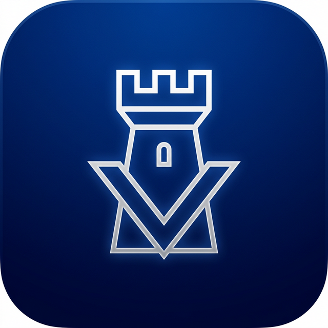
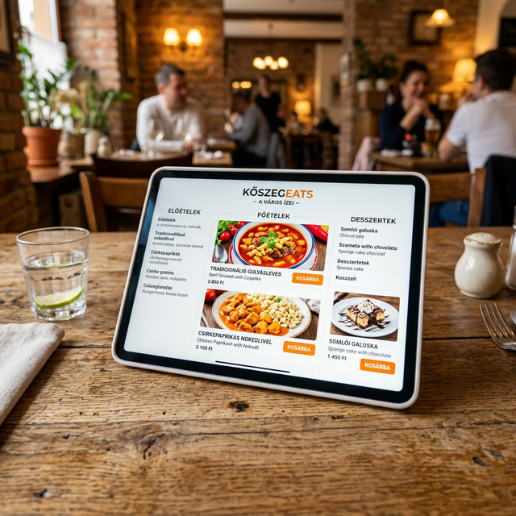
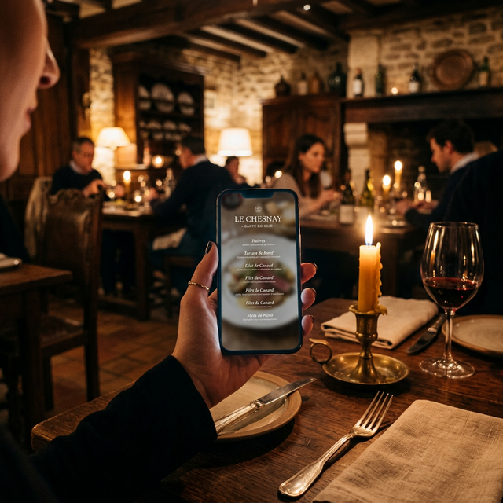

# VISITKOSZEG.HU: Visual Identity Assets

I have generated the final minimalist logo and the initial brand assets for your new Facebook page.

## 1. Final Profile Picture / Logo
An ultra-premium, minimalist app icon. Features a geometric castle tower symbol merged with a subtle 'V'.

## 2. Facebook Cover Photo
A cinematic blend of Kőszeg's heritage and the modern mobile experience.

## 3. Treasure Hunt Poster
Atmospheric, adventure-focused visual for the gamification module.

## 4. KőszegEats Merchant Mockup
Professional product shot to show restaurants how their menu will look on a tablet.

## 5. Keyhole Teaser
Cinematic teaser image for the very first post. A hidden view of Kőszeg.

## 6. Digital Moss Teaser
Subtle digital light glowing from the cracks of an ancient stone wall. High-end teaser.

## 7. Mysterious Eats Teaser
Candlelit scene suggesting a new way to interact with local menus.

## 8. Digital Hourglass Teaser
Antique hourglass with glowing binary code instead of sand. Visualizes 'The Moment'.

